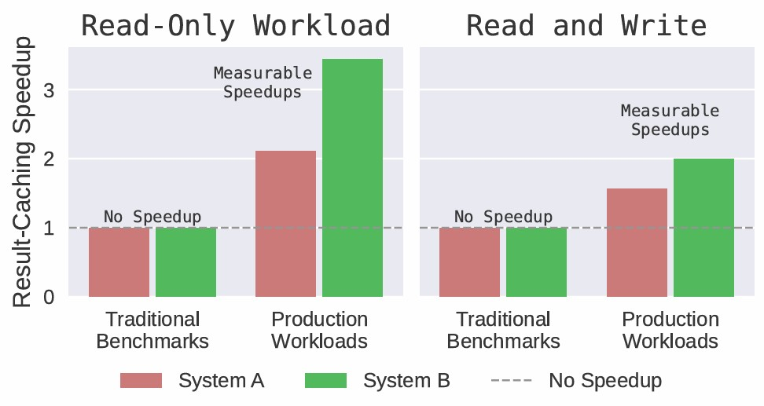
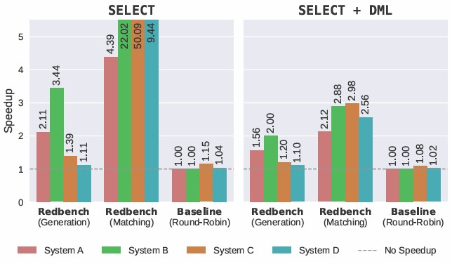
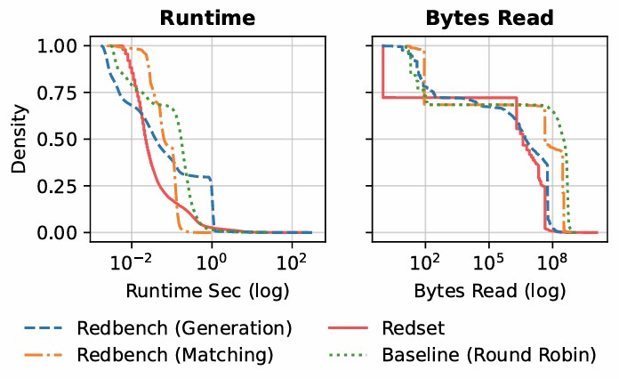

# Redbench-Eval

**Evaluation scripts and benchmarking tools for [Redbench](https://github.com/DataManagementLab/Redbench)**

<p align="center">
    
    
    
</p>

---

## 📋 Overview

Redbench-Eval provides evaluation and benchmarking infrastructure for workloads generated by Redbench. This repository includes:

- **Query Execution**: Tools to execute workloads on various database systems (e.g., DuckDB)
- **Performance Analysis**: Scripts to analyze execution traces and caching behavior
- **Visualization**: Jupyter notebooks for generating performance plots and similarity analyses

## 🚀 Quick Start

### Prerequisites

- Python 3.11 or higher
- [uv](https://github.com/astral-sh/uv) package manager (recommended) or pip

### Installation

1. **Clone the repository**
   ```bash
   git clone https://github.com/DataManagementLab/Redbench-Eval.git
   cd Redbench-Eval
   ```

2. **Set up Python environment**
   ```bash
   uv sync
   ```

3. **Activate the environment**
   ```bash
   source .venv/bin/activate
   ```

4. **Generate workload files**
   
   First, run [Redbench](https://github.com/DataManagementLab/Redbench) to generate the workload files. All necessary data files (including DuckDB databases) will be automatically downloaded.

## 📊 Usage

### Running Benchmarks

#### DuckDB Workload Execution

Execute generated workloads on DuckDB using the following command:

```bash
python src/redbench_eval/duckdb/execute_queries.py \
  --result_dir "../Redbench/output" \
  --dataset imdb \
  --redset_dataset serverless \
  --exp_hash ede5387599ee1e65c105eaa9b17c5c3c \
  --cluster_id 0 \
  --database_id 0 \
  --strategy generation \
  --db_file "../Redbench/output/tmp_generation/imdb/db_augmented_x2.duckdb"
```

**Parameters:**
- `--result_dir`: Directory containing Redbench output artifacts
- `--dataset`: Dataset name (e.g., `imdb`)
- `--redset_dataset`: Redset dataset type (e.g., `serverless`)
- `--exp_hash`: Experiment hash identifier
- `--cluster_id`: Cluster identifier
- `--database_id`: Database identifier
- `--strategy`: Execution strategy (e.g., `generation`)
- `--db_file`: Path to the DuckDB database file

**Output:**
The execution trace will be saved to `{result_dir}/{dataset}/{redset_dataset}/cluster_{cluster_id}/database_{database_id}/{strategy}_{exp_hash}/run_duckdb.parquet`

### Generating Visualizations

#### Redset Similarity Analysis

Run the Jupyter notebook for similarity analysis:

```bash
jupyter notebook src/redbench_eval/plots/paper_plots_redset_similarity.ipynb
```

#### Speedup and Caching Analysis

Generate speedup plots and caching drilldown visualizations:

```bash
jupyter notebook src/redbench_eval/plots/paper_plots.ipynb
```

## Adding New Database Systems

To add support for additional database systems:

1. Create a new directory under `src/redbench_eval/`
2. Implement an execution script similar to `duckdb/execute_queries.py`
3. Update the plotting notebooks to include the new system's results

## 👥 Authors

- **Johannes Wehrstein** - [johannes.wehrstein@cs.tu-darmstadt.de](mailto:johannes.wehrstein@cs.tu-darmstadt.de)


## 🔗 Related Projects

- [Redbench](https://github.com/DataManagementLab/Redbench) - Original workload generator

---

**Note:** The DuckDB execution example shown above is provided for reference and was not used in the original paper evaluation.